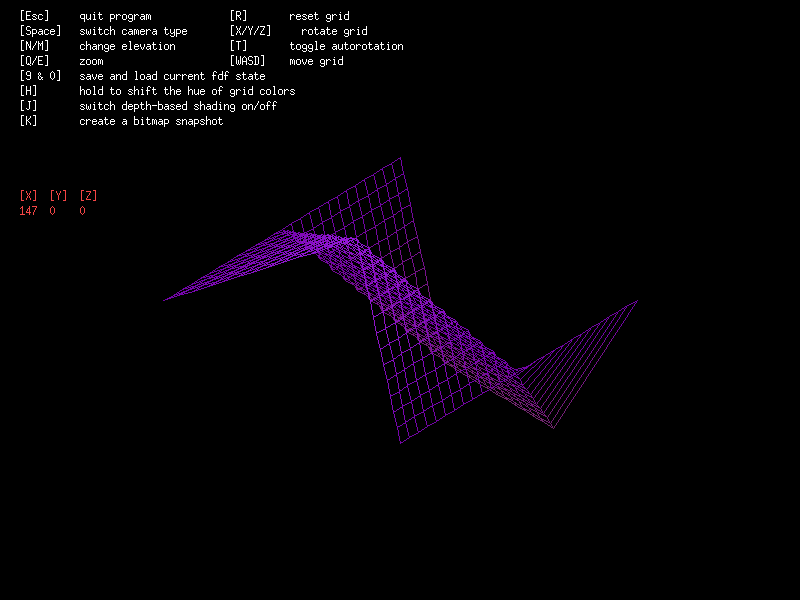
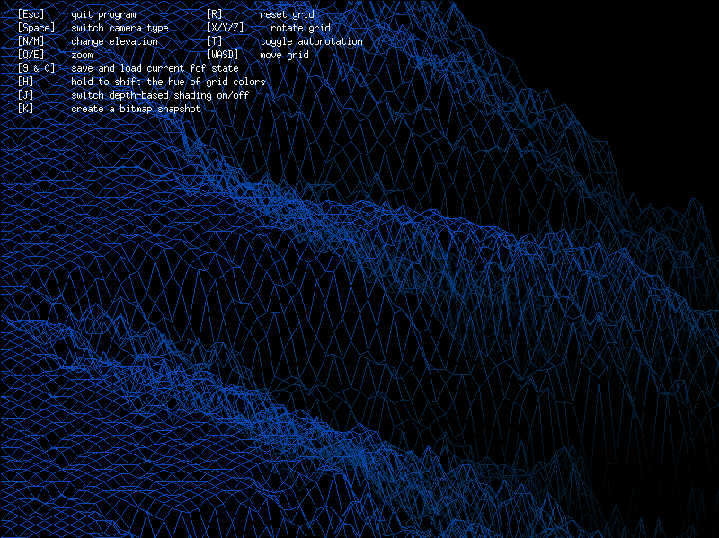
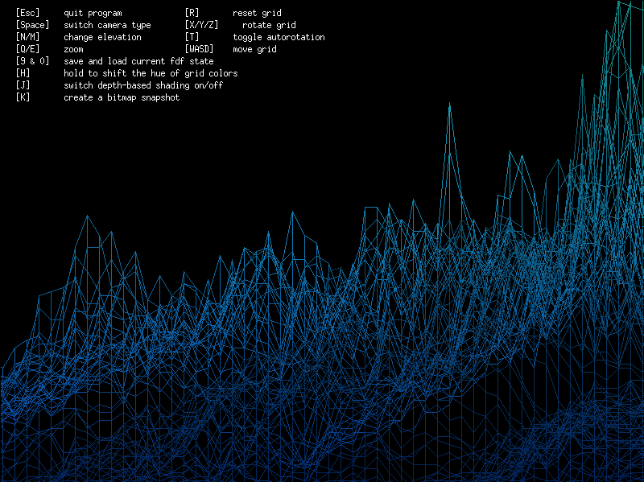

### 3D wireframe grid projection visualizer
Uses 42-school's X11 programming library MLX to visualize multiple 3D-to-2D projections of basic depthmaps based on [ARC/INFO ASCII grid](https://en.wikipedia.org/wiki/Esri_grid) format.  
Currently features an isometric view with full 3D rotation and orthographic front/elevation view with distance-based shading.  
Both views include options for RBG hue rotation, depth-based shading/highlights, unlimited zoom and 2D translation. 

Compiling on Linux requires packages `xorg libxext-dev libbsd-dev`  
Compiling on MacOS is untested, expect fiddling with header files.  

